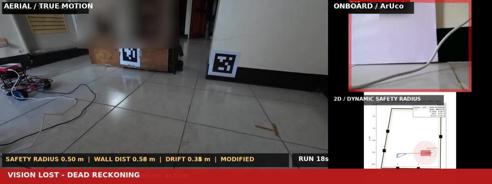

# 視覺導引移動機器人安全執行環境

一個安全感知命令執行環境，將不可靠的高層級視覺訊號轉換為受約束且經監理的命令，
透過經驗證的二進制序列協定傳送，最後由 STM32 控制器狀態機進行驗證。

```
相機 / 影片
  -> ArUco 標記偵測
  -> 高層級命令        （TURN_LEFT / TURN_RIGHT / FORWARD / STOP）
  -> 安全監理器        （信心閾值、目標遺失逾時、
                        近距離目標停車、命令速率限制）
  -> 二元協定編碼器
  -> 序列封包
  -> STM32 狀態機      （IDLE / ARMED / TRACKING / SAFE_STOP / FAULT）
  -> ROS 2 診斷
```

**開源研究專案。** 展示視覺導引差速車之自主導航、動態安全場規劃與 STM32 底層控制整合。

## 作品集示範：失視覺下的動態安全半徑

[](media/adaptive_safety_radius_demo.mp4)

ArUco 消失後，dead-reckoning 漂移使牆面安全半徑由 **0.20 m**
膨脹至 **0.50 m**；重新取得視覺時半徑縮回，機器人最後進入目標
15 cm 容許圈。影片同步呈現空拍、車載畫面、2D 估測軌跡、安全半徑、
牆距、漂移量與濾波模式，驗證失視覺期間的受限速行進與重定位後的精準到位。

---


## 問題背景

一台由單一相機引導的移動機器人，需透過 ArUco 標記偵測來追蹤目標標記。
相機畫面稀疏（2–10 Hz），機器人旋轉時標記會消失，偵測到的姿態雜訊可超過 10 cm。
自主堆疊（Nav2）位於安全層上方並發布速度命令；安全層則位於 Nav2 與馬達控制器之間，
對每條命令擁有最終決定權。

因此挑戰不僅是路徑規劃，而是建立一個執行期濾波器，能夠：

1. 當感知不可信時（無最近標記、里程計鏈路過舊）始終停車。
2. 安全時讓命令通過。
3. 偵測到危險時將命令修改為最安全的可行替代方案。
4. 在各種障礙物幾何與感測器雜訊組合下達成零碰撞。

---

## 架構

### 主機端（`vgr_driver` / `vgr_core`）

- **OpenCV ArUco 標記偵測** — 從前視相機進行的姿態估測。
- **命令映射器** — 將標記 ID 與方位映射為：
  `TURN_LEFT`、`TURN_RIGHT`、`FORWARD`、`STOP`。
- **安全監理濾波器** — `safety_sim/filters/` 目前有十種方法；下表列六種核心方法：

  | 濾波器       | 家族             | 原理                                              |
  |-------------|------------------|--------------------------------------------------|
  | `gf_dwa`    | 採樣/預演         | 49 個候選 (v, ω) 組合各往前預演 1 秒；保留最安全且最接近原本命令的 |
  | `safe_apf`  | 勢場              | 牆壁的斥力 + 目標的引力；合力向量決定安全航向       |
  | `cbf`       | 解析屏障          | 每面牆 `v ≤ α·(距離 − 半徑 − 裕度)`，投影到 (v, ω) 半平面 |
  | `iccbf`     | 解析屏障          | CBF 裕度再扣掉煞車距離；對有限馬達時間常數 τ 有效    |
  | `nh_vo`     | 速度障礙          | 碰撞錐幾何；將速度向量重新導向錐外                  |
  | `geofence_vo` | 速度障礙        | 沿速度方向射線探測；會碰撞就修正方向                 |

- **二元協定編碼器** — 小端序封包，含序號、命令位元組與加總 checksum。
- **ROS 2 Topic 橋接器** — 發布 `/vision/target`、`/robot/high_level_command`、
  `/mcu/state`、`/diagnostics`。
- **驗證與報告工具** — 每次管線執行後產生機器可讀的認證報告。

### STM32 端（Nucleo F446RE）

- **USART2 虛擬序列埠** — 115 200 鮑率，8N1。
- **位元組逐一封包接收器**，含序號驗證與加總 checksum。
- **狀態機**五個狀態：`IDLE → ARMED → TRACKING → SAFE_STOP / FAULT`。
- **心跳重新同步** (`HEARTBEAT seq=0`) — 啟動時及序號不符時觸發。
- **狀態遙測** — 10 位元組封包，回傳目前狀態與乾式執行馬達意圖。

---

## 安全層評估

目前的可重現矩陣包含 **10 種 filter × 8 個標準情境**。部署用
`safe_apf` 通過 S1–S7；full-field `safe_apf_new` 是唯一同時通過
S8 障礙繞行情境的方法。完整結果由程式即時產生，不在 README 保存
容易過期的手抄數字：

```bash
python3 -m safety_sim list
python3 -m safety_sim compare --output /tmp/compare.md
```

各情境回報淨空、故障後停車時間、介入比例與命令失真；模型限制與
參數依據見 `docs/safety_sim_guide.md`。

---

## STM32 / ROS 2 / Nav2 認證證據

以下證據混合純單元測試、Gazebo 驗收與硬體 bench；每列標示來源。

### STM32（Nucleo F446RE）

| 認證項目                         | 結果  | 證據                            |
|--------------------------------|-------|--------------------------------|
| 序列 fault 注入（錯誤 checksum、序號、位元組） | PASS | `test_firmware_drill.py`、`test_mock_mcu.py` |
| USART2 封包格式與接收契約          | PASS  | `test_firmware_protocol_contract.py` |
| 狀態機轉換 IDLE→ARMED→TRACKING | PASS  | `docs/stm32_nucleo_f446re_phase2.md` |
| 序號不符時心跳重新同步          | PASS  | `docs/stm32_uart_smoke_test.md` |
| 乾式執行馬達意圖遙測（10 位元組封包） | PASS  | `docs/stm32_nucleo_f446re_phase2.md` |
| 馬達空運轉認證（不需實際馬達）   | PASS  | CLI：`certify_motor_intent`     |

### ROS 2

| 認證項目                         | 結果  | 證據                        |
|--------------------------------|-------|----------------------------|
|  Topic 資料正確性（序列橋接器） | PASS  | `certify_ros2_topics` CLI  |
| 端對端影片檔案管線（含序列橋接） | PASS  | `ros2_e2e_bridge` CLI      |
| 所有 Nav2 生命週期節點啟動       | PASS  | 2026-07-13 Pi bench 紀錄    |
| 完整 TF 鏈（odom→base_link→camera） | PASS | 2026-07-13 Pi bench 紀錄    |

### Nav2（Gazebo + 樹莓派試驗台）

| 認證項目                                      | 結果  | 證據                                      |
|---------------------------------------------|-------|------------------------------------------|
| Gazebo 地面真值里程 + 偽 ArUco 障礙物目標     | PASS  | `run_nav2_scenario.sh ground_truth pseudo` |
| Gazebo 輪里程 + 偽 ArUco 障礙物目標           | PASS  | `run_nav2_scenario.sh wheel_odom pseudo`   |
| Pi Jazzy + 真實編碼器 `/odom` — 靜止保持 20.21 Hz | PASS | 2026-07-13 |
| Pi Jazzy + 真實編碼器 `/odom` — 10 cm NavigateToPose | PASS（6.40 秒） | 2026-07-13 |
| Pi Jazzy + 真實編碼器 `/odom` — 1 m 行駛 | PASS（5.652 秒） | 2026-07-13 |


---

## 技術特點與邊界處理

1. **動態膨脹優於固定邊界**：盲走時半徑隨時間與里程線性膨脹，兼顧開闊區通過性與近牆安全性。
2. **多濾波器對抗比較**：驗證 10 種演算法在 8 種極端情境（雜訊、斷訊、失控）下的安全包絡。
3. **雙層安全架構**：高層 Nav2 規劃速度，獨立 Safety Gate 擁有最終否決與限速權，底層 STM32 狀態機進行封包驗證。
---

## 快速啟動

```bash
# 1. 純 Python 模擬與測試
python3 -m venv .venv
source .venv/bin/activate
pip install ".[demo,dev]"
python3 -m safety_sim list

mkdir -p outputs
deactivate
# 2. ROS 2 節點需使用系統 ROS，不要用 pip 安裝 rclpy
source /opt/ros/humble/setup.bash
colcon build --base-paths ros2_ws/src \
  --packages-select vgr_core vgr_driver vgr_runtime vgr_safety_gate vgr_nav2_bringup
source install/setup.bash

# 3. 使用自備 ArUco 影片執行視覺管線
python3 -m vgr_driver.cli.run_demo \
  --video marker_video/marker_left.webm \
  --max-frames 300 \
  --report outputs/marker_left_report.json

# 4. 下列硬體命令需要 STM32 與 /dev/ttyACM0
python3 -m vgr_runtime.cli.run_all_certifications \
  --controller serial \
  --device /dev/ttyACM0 \
  --baudrate 115200
```

---

## 測試

```bash
# 執行測試前先設定 source-only PYTHONPATH
export PYTHONPATH="\
.:\
ros2_ws/src/vgr_core:\
ros2_ws/src/vgr_driver:\
ros2_ws/src/vgr_runtime:\
ros2_ws/src/vgr_safety_gate"

python3 -m pytest tests/ -v
```

公開版已驗證：**776 passed / 9 skipped**。測試不需機器人硬體；
ROS 2 與 serial 介面在 unit tests 中使用 mock。跳過項目需要未隨附的
實測 bag，或對應已記錄的參考 marker 可見度限制。

---

## 文件地圖

| 文件                                       | 內容                                     |
|------------------------------------------|----------------------------------------|
| `docs/safety_layer_tutorial.md`          | 六種濾波器教學，含車輛參數、數學、程式碼對照  |
| `docs/safety_sim_guide.md`               | 執行 `safety_sim compare` 及對抗搜索      |
| `docs/protocol_v1.md`                    | 二進制序列協定有線格式、狀態、遙測封包格式     |
| `docs/nav2_sim_guide.md`                | Gazebo + RViz Nav2 堆疊、場景腳本、TF 樹、已知限制 |
| `docs/demo_guide.md`                    | 示範操作指南                             |
| `docs/stm32_uart_smoke_test.md`          | STM32 UART 冒煙測試程序                   |
| `docs/stm32_cli_without_cubeide_gui.md`  | 從 CLI 建構並燒錄 STM32 韌體              |
